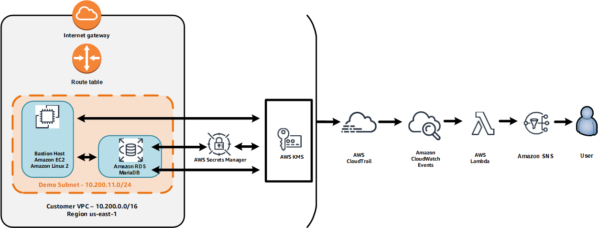

## Data Protection in AWS
## License Summary

This sample code is made available under a modified MIT license. See the LICENSE file.

# ___AWS re:Invent 2018 SEC372 Data Protection in AWS___

## Introduction

This repository contains materials that are being used for the AWS 2018 re:Invent builder session talk entitled:

SEC372 Data Protection in AWS

In this builder session we will create an architecture that leverages data protection services including AWS AWS Serets Manager and AWS KMS.  Here's a diagram of what we will build.



Here are the main points of the architecture:

- The bastion host is an Amazon Linux2 EC2 instance.
- The backend database is an Amazon RDS MariaDB instance.
- AWS Secrets Manager is used to rotate the password for the MariaDB database.
- A background process on the Amazon EC2 instance looks for changes in the MariaDB password and updates the WordPress configuration accordingly.
- All CloudTrail API events trigger an AWS Lambda function which uses Amazon SNS to e-mail the event information to SNS topic subscribers.
- You will build the core network and compute infrastructure components with AWS CloudFormation.

## Prerequisites

### AWS Account

In order to complete build this architecture you'll need an AWS Account with full administrative access capabilities.

### Region

You will need to build this architecture in regions that offer the services used in the chalk talk including AWS CloudHSM, AWS KMS, AWS Secrets Manager, Amazon EC2, Amazon SNS, and AWS Lambda.
Use the [Region Table](https://aws.amazon.com/about-aws/global-infrastructure/regional-product-services/) to determine which services are available in a Region.
We will use us-east-1 in this documentation.

### Awareness of AWS Services and Networking Technologies

You should be comfortable with:

- AWS console usage
- AWS services including Amazon EC2, Amazon SNS, and AWS CloudFormation
- Networking technologies such as DNS

### E-mail address

You will need an e-mail address.
This e-mail address is used to configure WordPress, register a staging TLS/SSL certificate with LetsEncrypt, and to receive CloudTrail API events via Amazon SNS.

### Charges

You will incur charges for the services used in these modules.
The pricing for each service is available on that service's pricing page.

The resources built in this chalk talk include (but are not limited to):

- an Amazon EC2 t2.small instance that serves as a bastion host, web server and WordPress host
- an Amazon RDS db.t2.small mySQL instance
- an AWS KMS CMK
- an AWS CloudTrail trail
- an Amazon SNS topic

## Security Notes

The purpose of this repository is to provide an illustration of how certain security services can work together.
The templates and procedures in this repository should not be considered as "best practice" implementations.
There are many considerations to take into account when deploying a production web site that have not been taken into account in this repository.

Example:

- The mariadb.newway.sh script fetches the database password and store it in an environment variable.
This is not a best practice and was done only for demonstrative purposes.

## Build Procedure

### 1.  Build the CloudFormation VPC stack.

NOTE: As of the time of this writing, there is a beta version of the CloudFormation console available for testing.  The instructions below assume the pre-beta version of the CloudFormation console.

- 1.1 - Download the data-protection-vpc-yyyymmdd.yaml file in this repository (where yyyymmdd represents the version date) and save it to your workstation.
- 1.2 - Go to the Cloudformation service console.
- 1.3 - Click Create new stack.
- 1.4 - Click Choose File and select the file you downloaded in step 1.1.
- 1.5 - Enter *dataprot-vpc* for the stack name.  Leave the other parameters unchanged unless you must choose a different CIDR block.
- 1.6 - Click Next.
- 1.7 - On the Options page, click Next.
- 1.8 - Check the box to acknowledge the creation of IAM resources and click Create.  The stack build should only take a few minutes.  While the stack build is happening, feel free to continue to step 2.

### 2. Create an Amazon EC2 Key Pair.

Amazon EC2 key pairs are used to provide authentication when connecting to Amazon EC2 instances.
A later CloudFormation template will also install AWS Systems Manager Session Manager that also provides connectivity.
Having both methods available can be useful in case any problems arise during the build of a CloudFormation stack.

- 2.1 - Create an Amazon EC2 key pair using the instructions found [here](https://docs.aws.amazon.com/AWSEC2/latest/UserGuide/ec2-key-pairs.html#having-ec2-create-your-key-pair).
- 2.2 - Create the associated private key for the Amazon EC2 instance depending on the program you are using for SSH protocol access.  For example, if you are using the program *putty*, you might create the private key with *puttygen*.

### 3. Create an Amazon SNS topic.

You will now create an SNS (Simple Notification Service) topic and subscribe your e-mail address to the topic.
The CloudFormation template that you will run later will set up a CloudWatch Event Rule to send certain AWS API events (for example, Secrets Manager rotation notifications) to this topic which will then be sent to subscribers of the topic.

Go to the Amazon SNS console and create an SNS topic with the following values:

| Field | Value |
| ----| ----- |
| Topic name| aws-data-protection |
| Display name | dataprot |

In these instructions we will use the topic aws-data-protection.
Copy the Topic ARN into a scratch file on your workstation.
You will need the ARN later.
The Topic ARN begins with the character *arn:*.
Create a subscription for your e-mail address to the topic using the "email" type (not "email-json").

### 4. Create a KMS CMK (Customer Master Key).

Go to the Amazon KMS console and create a CMK (Customer Master Key).
Use the key alias *aws-data-protection*.
Copy the ARN (Amazon Resource Name) of the CMK into a scratch file on your workstation.
You will need the ARN later.
Make sure you add your own user id and any roles that you use to the list of authorized administrators and users.
You can get the ARN by looking at the key details after you create the ke.

### 5. Configure Systems Manager Parameter Store.

You are now going to configure the ARNs as parameters in AWS Systems Manager Parameter Store.
This will make it easier to supply the values to the CloudFormation template that you will process later.

- 5.1 - Go to the Systems Manager service console and select *Parameter Store*.
- 5.2 - Create the parameters listed below.  You can leave the descriptions blank.

| Name | Value |
| ----| ----- |
| data-protection-cmk-arn | the ARN of your AWS KMS CMK |
| data-protection-topic-arn | the ARN of your AWS SNS topic |

### 7.  Build the CloudFormation WordPress stack.

- 7.1 - Return to the CloudFormation service console.
- 7.2 - Verify that the dataprot-vpc stack has a status of COMPLETE.
- 7.3 - Download the keeping-secrets-main-yyyymmdd.yaml file in this repository (where yyyymmdd represents the version date) and run it through CloudFormation.
There are two sections for parameters.
The first section is for parameters you must update.
The second section is for parameters whose default values are generally acceptable.

| Parameter | Value |
| ----| ----- |
| Stack name | dataprot-main |
| MariaDB database name | the name of the MariaDB database to be created |
| key pair | select an Amazon EC2 key pair from the dropdown menu |

- Note that the e-mail address will be sent to LetsEncrypt and WordPress.  See the web sites for information about their privacy policies.

### 8. Verify the initial configuration of the secret.

- 8.1 - Go to the Secrets Manager service console and select the secret named *smdemo* (or whatever you changed the secret name to in the CloudFormation template).  The Rotation Configuration section shows that rotation is currently disabled.

- 8.2 - Click on Retrieve secret value.   You will see that the username, password, and database information have already been configured.  Copy the username and password to a scratch file on your workstation.  Click Close.

### 9. Log in to the bastion host and check connectivity.

- 9.1 - Sign into the instance using either your ssh tool or AWS Systems Manager Session Manager.  If you use an ssh tool, you can locate the IP address of the instance on the CloudFormation output section for the dataprot-main stack under *BastionIP*.  If you sign in using AWS Systems Manager Session Manager, use the following commands to move into the home director for the user *ec2-user*:

```
sudo su ec2-user
cd
```

- 9.2 - Display the contents of the file mysql.oldway.sh using the cat command.   This shell script has hard-coded credentials for the initial username and password.

- 9.3 - Run the following commands:

```
./mysql.oldway.sh
use smdmeo;
select * from bookinfo;
quit;
```

The *select* statement should have returned one entry for Charles Dickens' Tale of Two Cities.

- 9.4 - Display the contents of the file mysql.newway.sh using the cat command.   This shell script uses AWS Secrets Manager to fetch the credentials for the initial username and password.  Note that the shell script uses an environment variable to hold a password.  This is **not** a best practice.   It is done here only for convenience as a demo.

- 9.5 - Run the following commands:

```
./mysql.newway.sh
use smdmeo;
select * from bookinfo;
quit;
```
You should see the same book entry as in step 9.3.

- 9.6 - Go go the Secrets Manager service console and select the secret.

- 9.7 - Click Edit rotation and enter the values below.

| Parameter | Value |
| ----| ----- |
| Enable automatic rotation | selected |
| Select rotation interval | 30 days |
| Create a new Lambda function | selected |
| New Lambda function name | dataprot |
| Use this secret | selected |

Click Save.
You will see a message telling you rotation is in progress.
Do not leave the screen until you get a message saying that rotation has been completed.
Once the roration has completed, click Retrieve secret value and compare the credential with the value you copied to in the scratch file in step 8.2.
The password should have changed.
If the password didn't change, refresh the screen and retrieve the scret again.

- 9.8 - Go back to the login session on the instance.

- 9.9 - Try the mysql.oldway.sh script again.   It should fail since the credentials were hardcoded into that file and have since been rotated.

- 9.10 - Repeat step 9.5 with mysql.newway.sh.  You should be able to retrieve the book information because the shell script uses Secrets Manager to retrieve the credentials.

### 9. Clean up

- 9.1 - If you enabled the rotation of the database secret, you will see a CloudFormation stack with a name referencing the serverless application repository.  Delete that stack.
- 9.2 - Delete the CloudFormation stack you built from keeping-secrets-wp.yaml.
- 9.3 - Delete the CloudFormation stack you built from keeping-secrets-vpc.yaml.
- 9.4 - Delete any S3 buckets that were created during the launch of the stack.  The bucket names begin with the stack name followed by *-s3bucket-* and some random characters (e.g. dataprot-main-s3-bucket-1a2b3c4d).
- 9.5 - Delete any CloudWatch LogGroups that were created that you no longer need.

